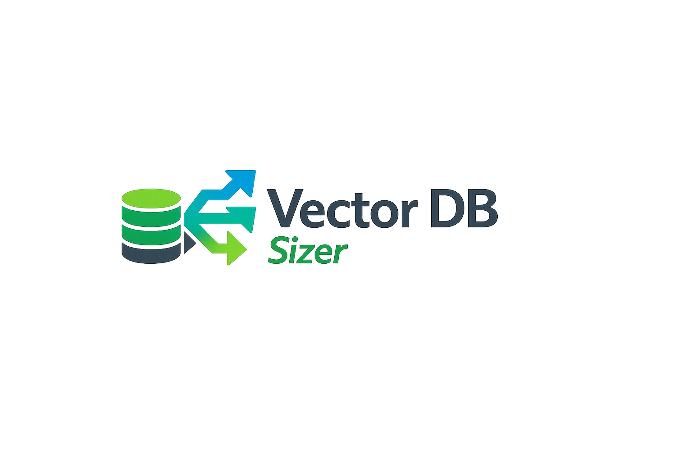

# vector-db-sizer

<div align="center">
  

  <p>
    <a href="https://deepwiki.com/center4aai/vector-db-sizer">
      
    </a>
    <a href="https://pypi.org/project/vector-db-sizer/">
      
    </a>
  </p>

  <p>
    Analytical CLI estimator for vector database disk and RAM sizing.
  </p>
</div>

## What it is

Use it for fast pre-implementation sizing work, such as:
- early architecture decisions;
- comparing vector dimensions;
- comparing engines;
- comparing index types;
- estimating metadata/payload impact;
- generating Markdown/CSV/JSON artifacts for architecture discussions.

## What it does not do

- No live database connections.
- No ingestion or load execution.
- No latency/recall benchmarking.
- No pricing calculations.
- No production guarantee.

## Quick start

Run directly from PyPI with `uvx`:

```bash
uvx vector-db-sizer --help
uvx vector-db-sizer list-engines
```

## Input YAML

```yaml
name: qdrant_text_hnsw

dataset:
  source_type: text
  total_tokens: 50000000
  chunk_tokens: 512
  chunk_overlap: 64

embedding:
  kind: dense
  dimensions: 1536
  dtype: float32

database:
  engine: qdrant
  index_type: hnsw
```

## Validate and estimate

```bash
uvx vector-db-sizer validate scenario.yaml
uvx vector-db-sizer estimate scenario.yaml --format markdown --out report.md
```

## Single-scenario example (from the local repository)

```bash
uv run vector-db-sizer estimate examples/qdrant_text_hnsw.yaml --format markdown
```

## Multi-scenario example (from the local repository)

```bash
uv run vector-db-sizer estimate examples/multi_scenario.yaml --format csv
uv run vector-db-sizer estimate examples/multi_scenario.yaml --format json
```

## Output formats

- `json` (machine-readable)
- `markdown` (human report)
- `csv` (comparison table)

## Supported engines

- generic
- pgvector
- qdrant
- milvus
- elasticsearch
- opensearch
- weaviate
- pinecone

## How to interpret the report

- **Raw vectors**: uncompressed/base vector bytes.
- **Quantized vectors**: additional quantized representation when modeled.
- **Record payload**: IDs + metadata/text/provenance payload bytes.
- **Index disk**: index structure bytes on disk.
- **Engine overhead**: engine/profile-level overhead approximation.
- **Final disk estimate**: replicated storage plus WAL/snapshot/safety factors.
- **Final RAM estimate**: vectors + payload + index + overhead RAM approximation.
- **Warnings**: profile caveats and scenario assumptions to review.
- **Confidence**: per-component confidence levels for planning.

## Confidence levels

- `high`: formulaic or type-level estimate.
- `medium`: useful engineering approximation.
- `low`: heuristic and engine-dependent; validate with pilot load.

## Production sizing warning

The estimates are analytical and should be calibrated with a representative pilot load before production capacity planning.

## Development

```bash
uv sync
uv run pytest
uv run ruff check .
```

## Current limitations

- Engine profiles are approximate.
- No vendor pricing model.
- No actual DB measurements from live systems.
- No latency/recall estimation.
- No automatic database selection.
